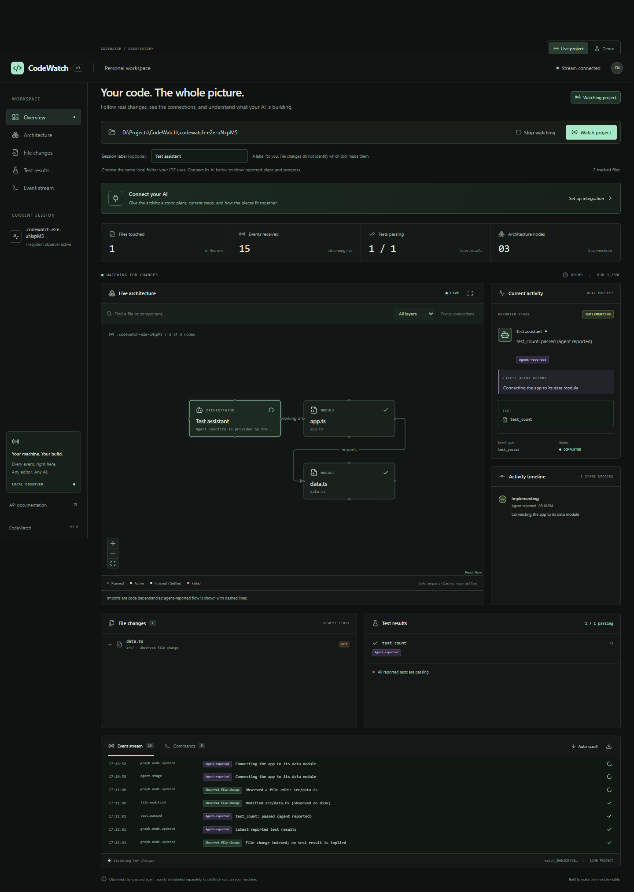

# CodeWatch

**See what your coding agent is building, and how the project connects.**

CodeWatch runs beside your existing editor or AI tool. Point it at a local project to see source files and import relationships change live. Connect its MCP server to an agent to see the agent's current task, affected files, reported architecture, commands, and test outcomes in the same graph.



## How it works, in plain language

You keep using your usual coding AI and editor. CodeWatch opens in a browser beside them and turns the work into a live map.

1. **Choose your project folder.** CodeWatch reads supported source files and draws their import connections. Saving, creating, or deleting a file updates the map.
2. **Connect your AI.** Add the configuration from **Connect your AI** to an MCP-capable coding tool. MCP (Model Context Protocol) is the interface that lets an agent call CodeWatch's reporting tools.
3. **Give the AI a task.** With the supplied reporting instructions, the agent describes its current step and names the files involved. Those files light up in the graph.
4. **Explore the connections.** Select a file to see incoming and outgoing relationships, the connected file paths, and any explanation the agent supplied. Use search, layer filters, and **Focus connections** to narrow the view.
5. **Follow the outcome.** The activity timeline, file list, command output, and test results show what happened. File watching continues after the agent finishes.

### Example: asking an AI to build login

| What happens | What you see in CodeWatch |
| --- | --- |
| The AI reports "Building the login form" with `ui/Login.tsx` | The current task changes and the form's file is highlighted. |
| The AI saves the form and an API handler | The watcher records the real file changes. |
| The AI reports that the form submits to `api/login.py` | A dashed relationship connects the files; selecting one reveals the explanation. |
| The test command runs through the wrapper and writes a fresh JUnit report | Its actual exit code and individual test outcomes appear. |
| The AI reports completion | The task becomes complete; the map stays connected for later edits. |

**File changes are automatic. Task explanations need a cooperating agent.** CodeWatch does not read private reasoning or capture every AI action just because the integration is installed. The browser dashboard is ready to use; this release does not include a marketplace IDE extension.

### Find your way around

- [Install and run](#start-locally)
- [Connect your AI or IDE](#connect-your-ai--ide)
- [Capture commands and tests](#capture-actual-terminal-commands)
- [Understand the dashboard](#what-the-real-dashboard-shows)
- [Scanner coverage and limits](#scanner-coverage-and-limits)
- [Technical architecture](#event-and-transport-architecture)
- [Run the checks](#development-and-verification)
- [Integration setup and troubleshooting](docs/integrations.md)

## Three complementary sources

| Source | What it can show | What it does not establish |
| --- | --- | --- |
| Folder watcher | Real file creation, modification, deletion; supported static imports | Who edited a file, agent intent, runtime calls, test success |
| MCP / HTTP agent reports | Agent-provided stage, current action, affected files, relationships, commands and tests | Hidden reasoning or independently verified tool results |
| Explicit command wrapper | Executed command, working directory, output, exit code; fresh JUnit results | Commands launched outside the wrapper |

The dashboard labels these sources. An indexed or settled file does not mean its code is correct. Import edges show static dependencies; an agent-reported edge can describe a higher-level connection such as a browser calling an API. Neither is a runtime trace.

## Start locally

Requirements: **Python 3.12+**, **Node 22.12+**. No model API key or database server is required. Install dependencies once while online; the dashboard and project watcher run locally.

### Windows (PowerShell)

Clone the project and install its dependencies:

```powershell
git clone https://github.com/jarvis0626/CodeWatch.git
cd CodeWatch
python -m venv backend/.venv
.\backend\.venv\Scripts\python.exe -m pip install -r backend/requirements.txt
npm.cmd --prefix frontend ci
npm.cmd --prefix frontend run build
.\backend\.venv\Scripts\python.exe -m backend.cli serve
```

Open **http://127.0.0.1:8000**, enter the absolute path of the project you want to observe, and click **Watch project**. Keep your usual AI/editor working in that folder. CodeWatch updates as files change.

Or launch directly with a project:

```powershell
.\backend\.venv\Scripts\python.exe -m backend.cli watch 'D:\Projects\YourApp'
```

### macOS / Linux

Use Python 3.12 or newer:

```bash
git clone https://github.com/jarvis0626/CodeWatch.git
cd CodeWatch
python3 -m venv backend/.venv
backend/.venv/bin/python -m pip install -r backend/requirements.txt
npm --prefix frontend ci
npm --prefix frontend run build
backend/.venv/bin/python -m backend.cli serve
```

Open **http://127.0.0.1:8000**. The project you watch can be a different repository anywhere on your machine; enter its absolute folder path in the dashboard.

### Start it again later

Return to the CodeWatch folder and run the final `serve` command for your platform. Dependency installation and the frontend build are only needed on first setup or after relevant updates. Keep that terminal running; press **Ctrl+C** to stop the server. Sessions are held in memory, so reconnect the project after restarting.

### Optional short commands

From the repository root, install the editable Python package into your environment:

```powershell
.\backend\.venv\Scripts\python.exe -m pip install -e .
.\backend\.venv\Scripts\codewatch.exe watch 'D:\Projects\YourApp'
```

With that virtual environment activated, the commands are `codewatch` and `codewatch-mcp`. This is a local source installation, not a published marketplace package; keep this checkout and its built `frontend/dist/` in place.

### During frontend development

Run these in separate terminals:

```powershell
.\backend\.venv\Scripts\python.exe -m uvicorn backend.main:app --reload --port 8000
npm.cmd --prefix frontend run dev
```

Use **http://localhost:5173** for Vite development. `/api`, `/ws`, `/health`, and `/events/schema` proxy to the backend. The backend also serves the last built dashboard on port 8000. Rebuild frontend assets before using that single-process version after UI changes.

## Connect your AI / IDE

Click **Connect your AI** in the dashboard to copy a machine-specific configuration and the reporting instructions. It generates absolute paths to this installation; it does not change your IDE settings automatically.

1. Run CodeWatch locally and watch your project.
2. Add the generated CodeWatch MCP server to your tool's MCP configuration.
3. Enable the server/tools in that tool.
4. Give the agent the provided reporting instructions with your task.
5. Keep CodeWatch visible beside the editor, or in the editor's browser panel if it has one.

**[Full integration guide: Antigravity, ChatGPT/Codex, and other MCP clients](docs/integrations.md)**

Local MCP clients can launch the bridge through stdio. Agent activity appears when the agent actually calls the reporting tools; installing an MCP server alone does not intercept every internal action. Folder watching works even without MCP and does not attribute changes to a particular AI.

ChatGPT in a browser requires an additional supported connection, such as a configured Secure MCP Tunnel; it cannot launch this local stdio process directly. That remote setup is not provisioned by this project. See the integration guide's current official references and limitations.

### MCP tools

- `codewatch_watch_project`: attach a local project and return its session/run ID.
- `codewatch_status`: discover the current session.
- `codewatch_progress`: report stage, concise action, and affected paths.
- `codewatch_relationship`: describe a connection between two project files.
- `codewatch_test`: report a test attempt and its outcome.
- `codewatch_command`: report command start and finish with the same invocation ID.
- `codewatch_complete`: report that the agent's task is complete; watching continues.

Each report requires the current `run_id`. Old reports cannot accidentally update a different watched project. Names/identities are provided by the client; CodeWatch does not authenticate which model made a change.

## Capture actual terminal commands

The dashboard and MCP bridge never execute arbitrary project commands. Run the explicit wrapper yourself when you want real command output in the dashboard:

```powershell
.\backend\.venv\Scripts\python.exe -m backend.cli run -- python -m pytest
```

The command runs in the **watched project directory**, forwards output to your terminal, reports its exit code, and returns that exit code. Arguments are passed directly without an implicit shell. On Windows, use an executable such as `python.exe` or explicitly invoke your intended shell when shell syntax is needed.

To capture individual test cases, ask your test runner to produce JUnit XML:

```powershell
.\backend\.venv\Scripts\python.exe -m backend.cli run --junit .local/results.xml --attempt 1 -- python -m pytest --junitxml=.local/results.xml
```

Create the report's parent folder in your project if the test runner requires it. Use `--attempt 2` on the next run. Only a new/changed report inside the project is read; skipped cases are omitted. Output retained in the dashboard is capped at 16,000 characters, and JUnit input at 2 MB / 500 tests. Command output and names you send can contain sensitive text, so choose what you report to the local dashboard.

Other CLI commands:

```powershell
.\backend\.venv\Scripts\python.exe -m backend.cli status
.\backend\.venv\Scripts\python.exe -m backend.cli attach 'D:\Projects\OtherApp' --agent 'My coding agent'
.\backend\.venv\Scripts\python.exe -m backend.cli config
.\backend\.venv\Scripts\python.exe -m backend.cli stop
```

For a custom port: `serve --port 8010`, and put `--server-url http://127.0.0.1:8010` before `status`, `attach`, `config`, `stop`, or `run`.

## What the real dashboard shows

- An architecture graph built from actual indexed files, with search, layer filters, and focus on a node's connections.
- Solid import relationships and separately identified agent-reported relationships.
- The current reported task and active files, without inventing a stage from filesystem activity.
- Actual reported stage visits, including repeated testing/debugging cycles.
- Newest file changes first, including deletion, and source-labeled tests and commands.
- Bounded chronological event history and NDJSON download.
- Session identity, path, tracked files, changed files, counters, scan warnings, and connection status.
- Automatic reconnect with a complete graph snapshot and retained test/command/stage results.
- Stop/reconnect project controls. Closing a dashboard tab does not stop the watcher or other viewers.

One project is active per CodeWatch server process. Selecting another project switches the shared session for all connected viewers. To observe projects independently, run separate servers on different ports. Runs are kept in memory until the server stops; persistent historical replay is not implemented.

## Scanner coverage and limits

The watcher polls approximately every 750 ms and reads source files without executing them or modifying the watched repository.

- **Python:** AST-based local absolute/relative imports, package initializers and common `src/` layout.
- **JavaScript / TypeScript / JSX / TSX:** best-effort local relative static imports/exports, literal `require()`/`import()`, directory indexes, and TypeScript source behind `.js` imports.
- Other supported source/config languages appear as file nodes. Their dependencies are not fabricated.
- Package aliases, `tsconfig` path mappings, computed imports, remote APIs, database usage and runtime calls are not automatically resolved. Agents can explicitly report higher-level relationships.
- Folder/name-based roles such as frontend, API, service, repository and database are inferred labels, not semantic verification.
- Root `.gitignore` and `.codewatchignore` are respected. Dependency folders, generated output, common secrets/key files, binary files, symlinks and junctions are skipped. Nested ignore files are not interpreted.
- Default limits: 500 tracked files, 512 KB per file, with additional traversal/depth/total-byte caps. Warnings disclose incomplete scans. Watch a smaller subfolder for large repositories.
- The graph renders a bounded subset at a time for readability; filters and focus expose the rest. Snapshot state retains the full indexed graph.
- File state settles after a short highlight. Test failures stay failed until subsequent test reports resolve them.

A short-lived file created and removed between polls can be missed. Rapid changes can be coalesced into one observed update. Deleted or ignored files are removed from the graph; newly ignored files are not falsely reported as deleted on disk.

## Event and transport architecture

```text
Any editor / coding agent                MCP-capable agent
          |                                     |
          v                                     v
    Local project files                 CodeWatch stdio bridge
          |                                     |
          v                                     | HTTP reports
  Read-only scanner ----> Universal Events <----+
                                ^
                                | Explicit CLI command / JUnit capture
                                |
                          FastAPI session
                                |
                                | /ws/live (snapshot + events + heartbeat)
                                v
                        React Flow dashboard
```

Pydantic models validate producer data; matching Zod schemas validate the browser boundary. Each event has `schemaVersion`, unique `runId` / `eventId`, UTC timestamp, monotonic sequence, event type/status, `source`, optional `agentName`, and typed `data`.

Sources are `filesystem`, `agent`, `command`, `system`, and `simulator`. A source is provenance supplied by the local integration, not a cryptographic guarantee. The server assigns IDs/order. Agent reports describe actions and outcomes, not private reasoning.

`GET /events/schema` exposes the full contract. The live API is:

| Route | Purpose |
| --- | --- |
| `GET /health` | Health check |
| `GET /api/session` | Current watched session |
| `POST /api/watch` | Attach `{path, agentName?}` |
| `POST /api/watch/stop` | Stop `{runId}` |
| `GET /api/integrations` | Generated local MCP setup |
| `POST /api/agent/progress` | `{runId, agentName, stage, message, paths}` |
| `POST /api/agent/relationship` | `{runId, agentName, source, target, label, description?}` |
| `POST /api/agent/test` | `{runId, agentName, name, status, attempt, path?, details?}` |
| `POST /api/agent/command` | `{runId, agentName, commandId, command, status, output?, exitCode?}` |
| `POST /api/agent/complete` | `{runId, agentName, message}` |
| `WS /ws/live` | Shared session snapshots, events and heartbeats |
| `WS /ws/build` | Isolated simulated demo |

The live stream sends an initial `snapshot` containing session metadata, the last 500 events, retained outcomes/stage visits, and canonical nodes/edges; then `event` and `session` frames. Heartbeats arrive during quiet periods. Slow subscribers receive a fresh snapshot. The event log is a bounded recent window, not a durable audit log.

For direct local scripts, report HTTP JSON using the same routes. Producers must use current run IDs and project-relative paths; traversal, linked paths and common secret paths are rejected. Command outcomes must follow a started invocation, and older test attempts are rejected.

The server binds to loopback. Browser origins are checked, including WebSockets; mutating HTTP calls require JSON. This local release does not provide public hosting/authentication. `CODEWATCH_ALLOWED_ORIGINS` can extend the frontend origin list. `CODEWATCH_SERVER_URL` configures bridge/CLI clients; MCP configuration uses the backend's configured server URL. Do not expose this local observer as an unauthenticated public service.

## Demo mode

The original 36-second Todo simulation remains in the **Demo** tab. It emits 73 events, including a test failure, debugging, and a passing rerun. It is explicitly simulated and never writes the example files or runs those example commands. Use it to explore the UI without selecting a real project.

## Development and verification

The current implementation passed **67 backend tests, 13 frontend unit tests, and 6 browser tests**, plus a production build. A separate browser check verified the single-process launcher, real captured test results, and file-connection explanations. These checks cover CodeWatch itself; they do not mean every vendor's IDE was manually tested.

```powershell
.\backend\.venv\Scripts\python.exe -m pip install -r backend/requirements-dev.txt
.\backend\.venv\Scripts\python.exe -m pytest -q
.\backend\.venv\Scripts\python.exe -m ruff check backend
npm.cmd --prefix frontend test
npm.cmd --prefix frontend run build
npm.cmd --prefix frontend run test:e2e
```

Browser tests use installed Google Chrome and start/reuse ports 8000 and 5173. Close your interactive session before running them: the real-project test switches the watched project to a temporary fixture. If Chrome is unavailable, install Playwright Chromium and remove the `channel: 'chrome'` setting. Tests cover real file changes, reconnects, reports, stale runs, boundaries, MCP protocol/forwarding, command capture, and the simulated flow.

## Important files

```text
backend/
  main.py                   HTTP/WebSockets, local origins, built dashboard hosting
  cli.py                    Single-process launcher and local CLI
  command_capture.py        Explicit process output / JUnit capture
  observer/
    scanner.py              Bounded read-only source/import analysis
    manager.py              Watch lifecycle, diffs and subscribers
    session.py              Event history and canonical graph state
    reports.py              Agent activity, relationships, commands and tests
    requests.py, routes.py  Producer API
  mcp_server.py             Official-SDK stdio integration
  integrations/             Shared loopback client, generated config/instructions
  models/events.py          Universal event schema
  agent/                    Optional deterministic demo
frontend/src/
  hooks/useLiveEvents.ts     Persistent real-project connection
  state/build.ts            Shared event reducer
  types/events.ts           Runtime contract
  components/               Live graph, project setup, source-aware panels
  App.tsx, styles/           Dashboard and styling
```

## What is not automatic yet

Native IDE-specific tool-call hooks, packaged marketplace extensions, intercepting every agent action, remote/cloud workspace observation, symbol-level control flow, runtime tracing, advanced language/alias resolution, multi-project tabs, durable session history, and public authenticated hosting. MCP and the event API are the extension points for adding those capabilities without coupling the graph to a particular model.
