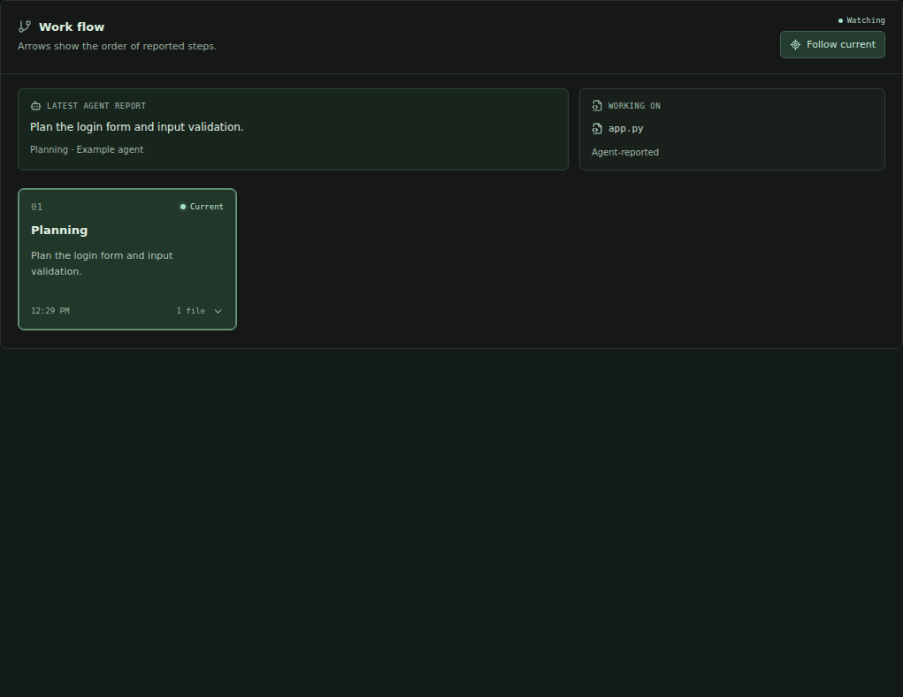
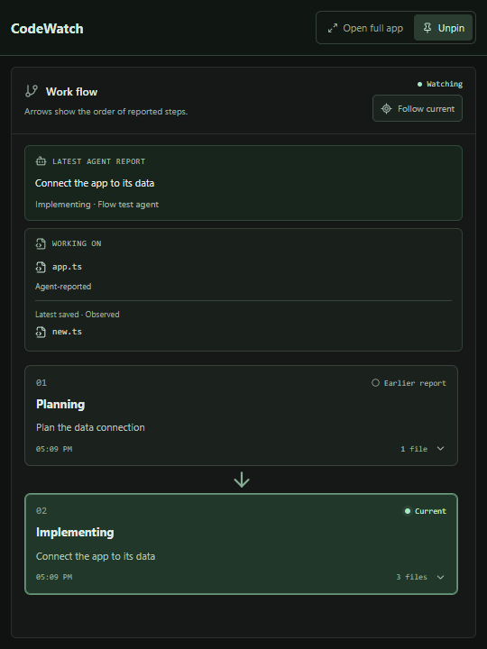
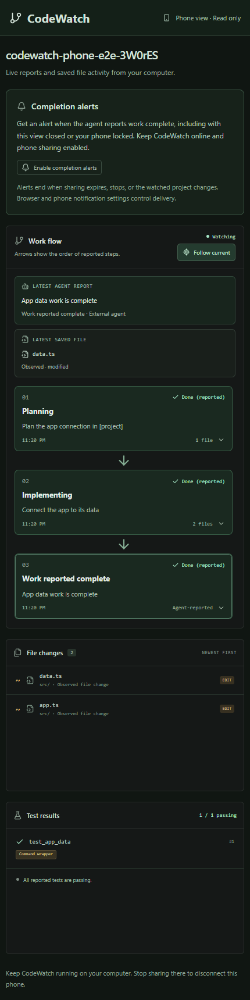
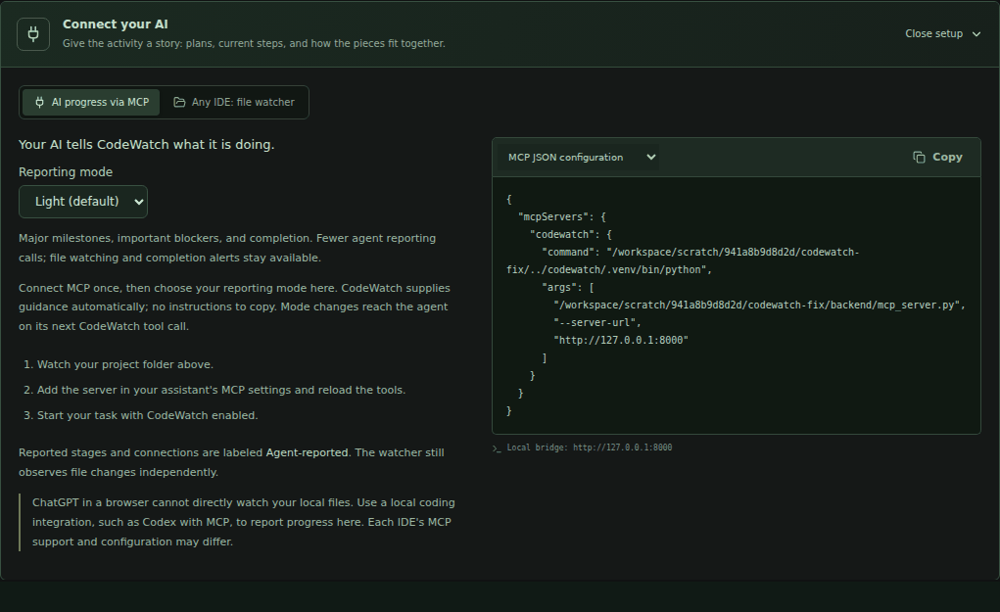

# CodeWatch

**Follow your coding agent’s progress without digging through its chat history.**

CodeWatch runs beside your editor and turns the agent’s reports into a connected work flow. See the current task, inspect the files involved, and check progress from your phone while the work continues on your computer.

[Download for Windows](https://github.com/jarvis0626/CodeWatch/releases/tag/v0.5.0) · [Connect your agent](docs/integrations.md) · [Phone setup](docs/phone-view.md) · [Run from source](docs/technical-reference.md#start-locally)

## See the work take shape

*Animated walkthrough captured from the running app using scripted example agent reports and real file saves. The demo shows the reporting workflow, not an autonomous agent building an application.*

Instead of scrolling back through a long coding conversation, keep the current work in view:

| When you want to… | CodeWatch helps you… |
| --- | --- |
| Know what the agent is working on | Follow concise step summaries and reported working files. |
| Understand a change | Select a step to inspect associated files, observed saves, reported results, and known connections. |
| Keep coding without switching windows | Pin the compact companion beside your editor. |
| Check a long task while away from your desk | Open the read-only phone view and enable completion alerts. |
| Understand how the project fits together | Browse folders and see which files import or use other files. |

**File changes are observed automatically. Step explanations and completion depend on the agent reporting them.** Connecting MCP alone does not capture every internal agent action or its private reasoning.

## Keep the flow beside your editor

Use **Always on top** to switch to the compact companion. It keeps the work flow, latest report, and working file visible. Click a step for details; choose **Open full app** when you want the complete project map and event log.

Keep using your existing editor and MCP-capable coding agent. CodeWatch is a separate companion app; you do not need to move your development into it.

## Check progress from your phone

Enable **Phone view**, scan the QR code, and follow the same project from another Wi-Fi network or mobile data. The phone view is read-only: it cannot run commands or send the agent another prompt.

Enable **completion alerts** in the paired phone browser to request background notifications. Keep the PC awake, online, and running CodeWatch with sharing active. On iPhone/iPad, use the Home Screen installation described in the [phone guide](docs/phone-view.md).

Sharing links are temporary and expire after eight hours. Restarting sharing requires a new link and alert setup. Browser permissions and OS notification settings affect delivery. “Work reported complete” means the agent reported completion; it does not certify that every test passed.

## Choose how much the agent reports

**Light** is the default in the current source version. It asks for major milestones, important blockers, and final completion. **Detailed** keeps step-by-step reports, command/test outcomes, and reported file relationships.

Both modes keep automatic file watching and completion notifications. Light asks for fewer MCP reporting calls; it does not guarantee a particular reduction in tokens or subscription usage.

Connect MCP once, then select **Light** or **Detailed** in **Connect your AI**. The desktop app remembers your choice. Your connected agent receives the selected guidance on its next CodeWatch tool call—no instruction text to copy and no mode-specific configuration to replace.

[Reporting mode setup](docs/integrations.md#light-and-detailed-reporting)

## Get started

### Windows desktop

1. Download the [v0.5.0 portable executable](https://github.com/jarvis0626/CodeWatch/releases/download/v0.5.0/CodeWatch-0.5.0-x64-portable.exe).
2. Open it and choose your project folder.
3. Open **Connect your AI**, add the generated configuration to your MCP-capable coding tool, then start a task with CodeWatch enabled.
4. Start your task. Pin the companion or enable phone viewing as needed.

The portable app includes its runtime: no Python, Node, Docker, or model API key is required. The Windows build is unsigned. Quit an older instance before opening a new version; there is no automatic updater.

**Version note:** source on `main` is v0.5.1. The Windows workflow publishes a new
release only after backend, browser, packaged notification, icon, and MCP checks
pass. Check the [latest release](https://github.com/jarvis0626/CodeWatch/releases/latest)
for the currently available EXE and [Actions](https://github.com/jarvis0626/CodeWatch/actions)
for builds in progress.

Copy MCP paths from **your own app**. After upgrading, refresh the configuration if the bundled helper path changes. Session history is currently held in memory and does not survive restarting the backend.

### Try it or run from source

The **Demo** tab provides a clearly labelled simulated workflow without attaching a real project. For a source installation, see [Windows, macOS, and Linux instructions](docs/technical-reference.md#start-locally).

## What you are looking at

CodeWatch keeps three sources of information distinct:

| Source | What it establishes |
| --- | --- |
| File watcher | A supported file was created, modified, or deleted; supported static imports were discovered. |
| Agent report | The agent described a task, connection, command, test result, or completion. |
| Explicit command wrapper | A command actually ran through the wrapper, with its output and exit code; fresh JUnit results can be captured. |

A saved file does not prove who edited it. An import graph is not a runtime trace. Agent-reported results are labelled separately from captured evidence.

The app does not yet provide native IDE interception, a marketplace extension, remote/cloud workspace observation, durable history, or multiple simultaneous project tabs. [Coverage and limitations](docs/technical-reference.md#scanner-coverage-and-limits).

## Technical details

The backend uses Python/FastAPI for bounded file watching, event validation, and session state. The React interface presents the work flow and project map. A local MCP bridge accepts agent reports, while the Electron desktop package supplies window, tray, and phone-sharing controls.

File observation and rendering do not call a model. Agent-written MCP reports use the connected coding agent. Optional phone sharing uses a separate paired, read-only viewer through a temporary Cloudflare tunnel; the desktop API stays local.

| Documentation | What you will find |
| --- | --- |
| [Technical reference](docs/technical-reference.md) | Source setup, MCP tools, API routes, event schema, scanner limits, architecture, and test commands. |
| [Integration guide](docs/integrations.md) | Agent configuration, Light/Detailed modes, and connection troubleshooting. |
| [Work flow guide](docs/work-flow.md) | Step cards, evidence, and the compact companion. |
| [Project map guide](docs/project-map.md) | Folders, imports, and agent-reported connections. |
| [Phone view guide](docs/phone-view.md) | Pairing, privacy, notifications, expiration, and network requirements. |
| [Windows packaging](docs/windows-packaging.md) | Build commands, packaged verification, and platform limitations. |
| [Demo media](docs/media/README.md) | How the README animations were captured. |
