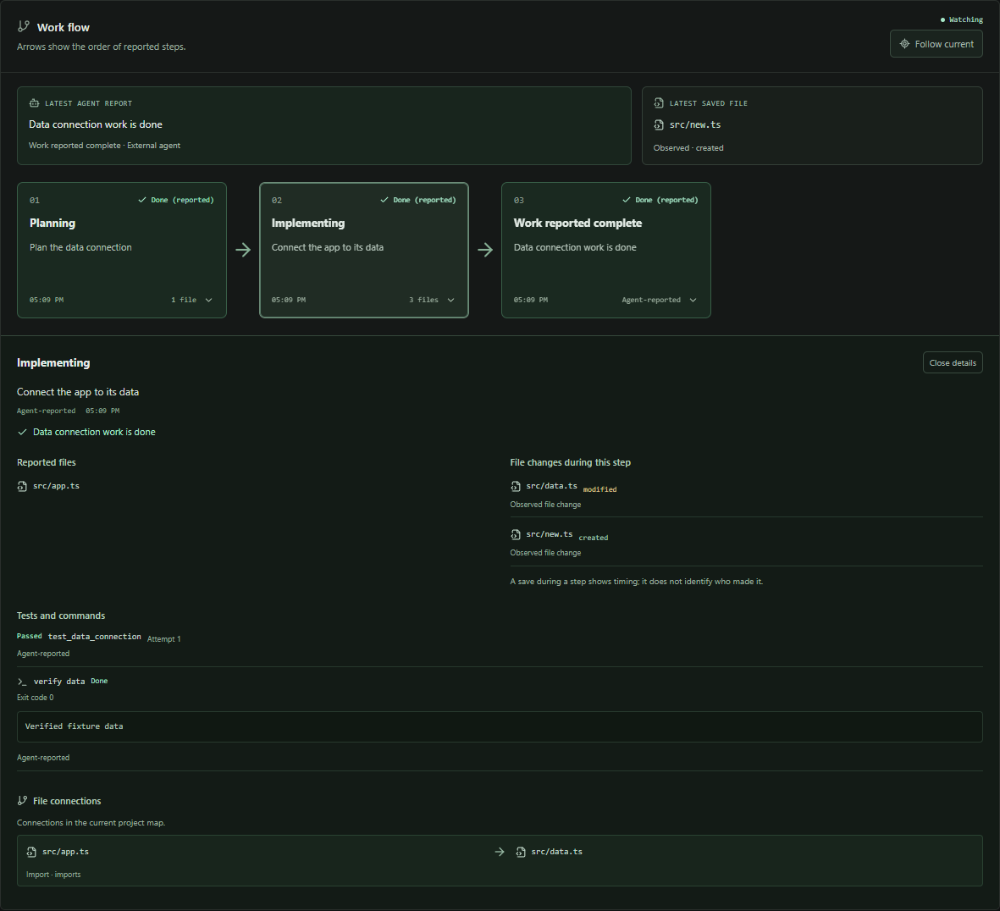

# CodeWatch

**See what your coding agent is building, and how the project connects.**

CodeWatch runs beside your existing editor or AI tool. On Windows, open the portable desktop executable and choose your project folder. Connect its MCP server to follow the agent's work as a flow of connected steps, with the latest report and reported working file in view. Pin the app to keep just this flow above your editor. Select a step to inspect its files, changes, tests, commands and known file connections; open the full app for the project map and event log.



## How it works, in plain language

You keep using your usual coding AI and editor. CodeWatch opens in its own desktop window and follows reported work and real saved files. The source CLI also supports the browser dashboard.

1. **Choose your project folder.** CodeWatch groups supported source files into your actual folders. Saving, creating, or deleting a file updates the map and recent changes.
2. **Connect your AI.** Add the configuration from **Connect your AI** to an MCP-capable coding tool. MCP (Model Context Protocol) is the interface that lets an agent call CodeWatch's reporting tools.
3. **Follow the work flow.** With the supplied reporting instructions, the agent describes its steps and names the files involved. Connected cards show their order and reported status. Select a card to see its file changes, results and known file connections. [Work flow guide](docs/work-flow.md).
4. **Pin it beside your editor.** **Always on top** opens the compact companion, showing only the flow, latest report and working file. **Open full app** restores the complete dashboard while keeping it pinned.
5. **Explore the project.** Open a folder or search for a file. Selecting it shows **Uses code from** and **Used by** lists, with agent-reported relationships explained separately. The full app includes the event log, command output and test results. File watching continues after the agent finishes. [Project map guide](docs/project-map.md).
6. **Follow from your phone.** Enable **Phone view** and scan its QR code. The read-only progress view works across networks through a temporary internet connection. Keep the PC awake and CodeWatch online. [Phone view guide](docs/phone-view.md).

### Example: asking an AI to build login

| What happens | What you see in CodeWatch |
| --- | --- |
| The AI reports "Building the login form" with `ui/Login.tsx` | The current task changes and the form's file is highlighted. |
| The AI saves the form and an API handler | The watcher records the real file changes. |
| The AI reports that the form submits to `api/login.py` | Selecting the file shows that connection and explanation under **Agent-reported connections**; its optional diagram uses a dashed line. |
| The test command runs through the wrapper and writes a fresh JUnit report | Its actual exit code and individual test outcomes appear. |
| The AI reports completion | The task becomes complete; the map stays connected for later edits. |

**File changes are automatic. Task explanations need a cooperating agent.** CodeWatch does not read private reasoning or capture every AI action just because the integration is installed. This build does not include a marketplace IDE extension.

### Find your way around

- [Open the Windows executable](#windows-desktop-no-installation)
- [Run from source](#start-locally)
- [Connect your AI or IDE](#connect-your-ai--ide)
- [Watch progress on your phone](docs/phone-view.md)
- [Capture commands and tests](#capture-actual-terminal-commands)
- [Understand the dashboard](#what-the-real-dashboard-shows)
- [Scanner coverage and limits](#scanner-coverage-and-limits)
- [Technical architecture](#event-and-transport-architecture)
- [Run the checks](#development-and-verification)
- [Integration setup and troubleshooting](docs/integrations.md)

## Three complementary sources

| Source | What it can show | What it does not establish |
| --- | --- | --- |
| Folder watcher | Real file creation, modification, deletion; supported static imports | Who edited a file, agent intent, runtime calls, test success |
| MCP / HTTP agent reports | Agent-provided stage, current action, affected files, relationships, commands and tests | Hidden reasoning or independently verified tool results |
| Explicit command wrapper | Executed command, working directory, output, exit code; fresh JUnit results | Commands launched outside the wrapper |

The dashboard labels these sources. An indexed or settled file does not mean its code is correct. Import edges show static dependencies; an agent-reported edge can describe a higher-level connection such as a browser calling an API. Neither is a runtime trace.

## Windows desktop: no installation

**[Download CodeWatch for Windows x64](https://github.com/jarvis0626/CodeWatch/releases/download/v0.5.0/CodeWatch-0.5.0-x64-portable.exe)** from the [v0.5.0 release](https://github.com/jarvis0626/CodeWatch/releases/tag/v0.5.0). This is the only file you need to copy to another Windows machine. Double-click it, click **Choose folder**, and keep using your editor. No terminal, Python, Node, Docker or model API key is required to run it.

If you build locally, the same file is at `dist/windows/CodeWatch-0.5.0-x64-portable.exe`. GitHub downloads require access to this repository. To upgrade, quit the previous CodeWatch instance (use **Quit CodeWatch** if it is in the tray), then open the new executable. There is no automatic updater.

Every launch opens the full app, including after a pinned companion session. A short first-run tutorial introduces folder watching, MCP reports, pinning and phone access. Completing or skipping it saves that choice in your Windows profile, so it stays dismissed on later launches.

The app opens a resizable window. **Always on top** switches to the compact work flow companion; **Open full app** restores the complete dashboard with the pin retained, and **Unpin** restores the full app without the pin. Both window sizes and positions are remembered. Closing it quits by default. Enable **Close to tray** to keep observing after closing the window; restore it from the tray, or choose **Quit CodeWatch** to stop its backend. CodeWatch only stops its own service.

Use **Connect your AI** for the existing cooperative MCP setup. The snippets launch a bundled helper, so MCP clients also need no installed Python. Client configuration and reporting instructions still require the setup described below; packaging does not add native vendor interception.

Copy the MCP configuration from **your own app**. Its paths use your Windows user-data directory; another person's `C:/Users/...` paths will not work on your machine. The helper filename includes a hash of the bundled executable: the same helper build has the same suffix, and a different build can have a different suffix. `desktop-connection.json` keeps the same filename inside each person's CodeWatch data directory. After upgrading, use the configuration shown by the app if its helper path changed.

To check the connection, ask your coding agent to use CodeWatch to report a short progress message and modify a source file. The report should appear in the **Work flow**, and the save should appear in its step details and **File changes**. A saved file alone verifies the watcher; an accepted agent report also verifies the MCP connection.

The portable executable extracts its bundled runtime automatically. Preferences, logs and a stable MCP helper live under `%APPDATA%/CodeWatch`; the discovery credential is encrypted with Windows DPAPI. Moving the portable executable does not break your MCP configuration. Sessions/history remain in memory in this version.

This build is unsigned. [Windows build and verification details](docs/windows-packaging.md) describe how to reproduce it and the tested capabilities.

Phone sharing is optional and starts off. **Enable phone view** creates a QR link to a separate read-only progress view through Cloudflare. It works on mobile data or another network while your PC stays awake and online. **Stop sharing**, changing projects, or quitting revokes it; it also expires after eight hours. The link is temporary, and the underlying Quick Tunnel has no uptime guarantee. [Phone access and connection details](docs/phone-view.md).

Fresh agent completion reports show a notification in the app and phone view, plus
a Windows notification while the desktop is hidden. Phone **Enable completion
alerts** requests permission for encrypted browser push, including with the phone
view closed or the screen locked. On iPhone, add the view to your Home Screen and
enable alerts there. Sharing must remain active; new sharing addresses need a new
setup. [Completion alert setup](docs/phone-view.md#completion-notifications).

The EXE, running window, tray and phone Home Screen use the same CodeWatch icon.
Windows notification registration creates a per-user Start Menu shortcut pointing
at your portable EXE. Opening the EXE after moving it updates that path.

## Start locally

Requirements: **Python 3.12+**, **Node 22.12+**. No model API key or database server is required. Install dependencies once while online; the dashboard and project watcher run locally.

### Windows (PowerShell)

Clone the project and install its dependencies:

```powershell
git clone https://github.com/jarvis0626/CodeWatch.git
cd CodeWatch
python -m venv backend/.venv
.\backend\.venv\Scripts\python.exe -m pip install -r backend/requirements.txt
npm.cmd --prefix frontend ci
npm.cmd --prefix frontend run build
.\backend\.venv\Scripts\python.exe -m backend.cli serve
```

Open **http://127.0.0.1:8000**, enter the absolute path of the project you want to observe, and click **Watch project**. Keep your usual AI/editor working in that folder. CodeWatch updates as files change.

Or launch directly with a project:

```powershell
.\backend\.venv\Scripts\python.exe -m backend.cli watch 'D:\Projects\YourApp'
```

### macOS / Linux

Use Python 3.12 or newer:

```bash
git clone https://github.com/jarvis0626/CodeWatch.git
cd CodeWatch
python3 -m venv backend/.venv
backend/.venv/bin/python -m pip install -r backend/requirements.txt
npm --prefix frontend ci
npm --prefix frontend run build
backend/.venv/bin/python -m backend.cli serve
```

Open **http://127.0.0.1:8000**. The project you watch can be a different repository anywhere on your machine; enter its absolute folder path in the dashboard.

### Start it again later

Return to the CodeWatch folder and run the final `serve` command for your platform. Dependency installation and the frontend build are only needed on first setup or after relevant updates. Keep that terminal running; press **Ctrl+C** to stop the server. Sessions are held in memory, so reconnect the project after restarting.

### Optional short commands

From the repository root, install the editable Python package into your environment:

```powershell
.\backend\.venv\Scripts\python.exe -m pip install -e .
.\backend\.venv\Scripts\codewatch.exe watch 'D:\Projects\YourApp'
```

With that virtual environment activated, the commands are `codewatch` and `codewatch-mcp`. This is a local source installation, not a published marketplace package; keep this checkout and its built `frontend/dist/` in place.

### During frontend development

Run these in separate terminals:

```powershell
.\backend\.venv\Scripts\python.exe -m uvicorn backend.main:app --reload --port 8000
npm.cmd --prefix frontend run dev
```

Use **http://localhost:5173** for Vite development. `/api`, `/ws`, `/health`, and `/events/schema` proxy to the backend. The backend also serves the last built dashboard on port 8000. Rebuild frontend assets before using that single-process version after UI changes.

## Connect your AI / IDE

Click **Connect your AI** in the dashboard to copy a machine-specific configuration and the reporting instructions. It generates absolute paths to this installation; it does not change your IDE settings automatically.

1. Run CodeWatch locally and watch your project.
2. Add the generated CodeWatch MCP server to your tool's MCP configuration.
3. Enable the server/tools in that tool.
4. Give the agent the provided reporting instructions with your task.
5. Keep CodeWatch visible beside the editor, or in the editor's browser panel if it has one.

**[Full integration guide: Antigravity, ChatGPT/Codex, and other MCP clients](docs/integrations.md)**

Local MCP clients can launch the bridge through stdio. Agent activity appears when the agent actually calls the reporting tools; installing an MCP server alone does not intercept every internal action. Folder watching works even without MCP and does not attribute changes to a particular AI.

ChatGPT in a browser requires an additional supported connection, such as a configured Secure MCP Tunnel; it cannot launch this local stdio process directly. That remote setup is not provisioned by this project. See the integration guide's current official references and limitations.

### MCP tools

- `codewatch_watch_project`: attach a local project and return its session/run ID.
- `codewatch_status`: discover the current session.
- `codewatch_progress`: report stage, concise action, and affected paths.
- `codewatch_relationship`: describe a connection between two project files.
- `codewatch_test`: report a test attempt and its outcome.
- `codewatch_command`: report command start and finish with the same invocation ID.
- `codewatch_complete`: report that the agent's task is complete; watching continues.

Each report requires the current `run_id`. Old reports cannot accidentally update a different watched project. Names/identities are provided by the client; CodeWatch does not authenticate which model made a change.

## Capture actual terminal commands

The dashboard and MCP bridge never execute arbitrary project commands. Run the explicit wrapper yourself when you want real command output in the dashboard:

```powershell
.\backend\.venv\Scripts\python.exe -m backend.cli run -- python -m pytest
```

The command runs in the **watched project directory**, forwards output to your terminal, reports its exit code, and returns that exit code. Arguments are passed directly without an implicit shell. On Windows, use an executable such as `python.exe` or explicitly invoke your intended shell when shell syntax is needed.

To capture individual test cases, ask your test runner to produce JUnit XML:

```powershell
.\backend\.venv\Scripts\python.exe -m backend.cli run --junit .local/results.xml --attempt 1 -- python -m pytest --junitxml=.local/results.xml
```

Create the report's parent folder in your project if the test runner requires it. Use `--attempt 2` on the next run. Only a new/changed report inside the project is read; skipped cases are omitted. Output retained in the dashboard is capped at 16,000 characters, and JUnit input at 2 MB / 500 tests. Command output and names you send can contain sensitive text, so choose what you report to the local dashboard.

Other CLI commands:

```powershell
.\backend\.venv\Scripts\python.exe -m backend.cli status
.\backend\.venv\Scripts\python.exe -m backend.cli attach 'D:\Projects\OtherApp' --agent 'My coding agent'
.\backend\.venv\Scripts\python.exe -m backend.cli config
.\backend\.venv\Scripts\python.exe -m backend.cli stop
```

For a custom port: `serve --port 8010`, and put `--server-url http://127.0.0.1:8010` before `status`, `attach`, `config`, `stop`, or `run`.

## What the real dashboard shows

- A connected work flow with selectable steps, latest report and agent-reported working file. Its arrows show report order; step details show actual known file connections.
- A compact pinned companion that keeps the flow visible beside your editor, with full-app controls for the complete dashboard.
- A project map of actual folders, recent changes, file search, and readable **Uses code from** / **Used by** lists. A small diagram is optional, and the map can be collapsed.
- Solid import relationships and separately identified agent-reported relationships.
- The current reported task and active files, without inventing a stage from filesystem activity.
- Actual reported stage visits, including repeated testing/debugging cycles.
- Newest file changes first, including deletion, and source-labeled tests and commands.
- Bounded chronological event history and NDJSON download.
- Session identity, path, tracked files, changed files, counters, scan warnings, and connection status.
- Automatic reconnect with a complete graph snapshot and retained test/command/stage results.
- Stop/reconnect project controls. Closing a dashboard tab does not stop the watcher or other viewers.

One project is active per CodeWatch server process. Selecting another project switches the shared session for all connected viewers. To observe projects independently, run separate servers on different ports. Runs are kept in memory until the server stops; persistent historical replay is not implemented.

## Scanner coverage and limits

The watcher polls approximately every 750 ms and reads source files without executing them or modifying the watched repository.

- **Python:** AST-based local absolute/relative imports, package initializers and common `src/` layout.
- **JavaScript / TypeScript / JSX / TSX:** best-effort local relative static imports/exports, literal `require()`/`import()`, directory indexes, and TypeScript source behind `.js` imports.
- Other supported source/config languages appear as file nodes. Their dependencies are not fabricated.
- Package aliases, `tsconfig` path mappings, computed imports, remote APIs, database usage and runtime calls are not automatically resolved. Agents can explicitly report higher-level relationships.
- Folder/name-based roles such as frontend, API, service, repository and database are inferred labels, not semantic verification.
- Root `.gitignore` and `.codewatchignore` are respected. Dependency folders, generated output, common secrets/key files, binary files, symlinks and junctions are skipped. Nested ignore files are not interpreted.
- Default limits: 500 tracked files, 512 KB per file, with additional traversal/depth/total-byte caps. Warnings disclose incomplete scans. Watch a smaller subfolder for large repositories.
- Folder cards summarize the full indexed project. File lists show up to 100 entries; search narrows longer lists. The optional diagram shows the selected file and up to three neighbors on each side, while its connection lists retain all known direct links.
- File state settles after a short highlight. Test failures stay failed until subsequent test reports resolve them.

A short-lived file created and removed between polls can be missed. Rapid changes can be coalesced into one observed update. Deleted or ignored files are removed from the graph; newly ignored files are not falsely reported as deleted on disk.

## Event and transport architecture

```text
Any editor / coding agent                MCP-capable agent
          |                                     |
          v                                     v
    Local project files                 CodeWatch stdio bridge
          |                                     |
          v                                     | HTTP reports
  Read-only scanner ----> Universal Events <----+
                                ^
                                | Explicit CLI command / JUnit capture
                                |
                          FastAPI session
                                |
                                | /ws/live (snapshot + events + heartbeat)
                                v
                        React Flow dashboard
```

Pydantic models validate producer data; matching Zod schemas validate the browser boundary. Each event has `schemaVersion`, unique `runId` / `eventId`, UTC timestamp, monotonic sequence, event type/status, `source`, optional `agentName`, and typed `data`.

Sources are `filesystem`, `agent`, `command`, `system`, and `simulator`. A source is provenance supplied by the local integration, not a cryptographic guarantee. The server assigns IDs/order. Agent reports describe actions and outcomes, not private reasoning.

`GET /events/schema` exposes the full contract. The live API is:

| Route | Purpose |
| --- | --- |
| `GET /health` | Health check |
| `GET /api/session` | Current watched session |
| `POST /api/watch` | Attach `{path, agentName?}` |
| `POST /api/watch/stop` | Stop `{runId}` |
| `GET /api/integrations` | Generated local MCP setup |
| `POST /api/agent/progress` | `{runId, agentName, stage, message, paths}` |
| `POST /api/agent/relationship` | `{runId, agentName, source, target, label, description?}` |
| `POST /api/agent/test` | `{runId, agentName, name, status, attempt, path?, details?}` |
| `POST /api/agent/command` | `{runId, agentName, commandId, command, status, output?, exitCode?}` |
| `POST /api/agent/complete` | `{runId, agentName, message}` |
| `WS /ws/live` | Shared session snapshots, events and heartbeats |
| `WS /ws/build` | Isolated simulated demo |

The live stream sends an initial `snapshot` containing session metadata, the last 500 events, up to 2,000 activity events for step evidence, retained outcomes/stage visits, and canonical nodes/edges; then `event` and `session` frames. Heartbeats arrive during quiet periods. Slow subscribers receive a fresh snapshot. History remains bounded and in memory.

For direct local scripts, report HTTP JSON using the same routes. Producers must use current run IDs and project-relative paths; traversal, linked paths and common secret paths are rejected. Command outcomes must follow a started invocation, and older test attempts are rejected.

The desktop API and MCP service bind to loopback. Browser origins are checked, including WebSockets; mutating HTTP calls require JSON. Optional phone sharing uses a separate, paired read-only viewer through a temporary tunnel; it does not publish the desktop API. `CODEWATCH_ALLOWED_ORIGINS` can extend the frontend origin list. `CODEWATCH_SERVER_URL` configures bridge/CLI clients; MCP configuration uses the backend's configured server URL. Do not expose the local observer as an unauthenticated public service.

## Demo mode

The original 36-second Todo simulation remains in the **Demo** tab. It emits 73 events, including a test failure, debugging, and a passing rerun. It is explicitly simulated and never writes the example files or runs those example commands. Use it to explore the UI without selecting a real project.

## Development and verification

The current implementation passed **176 backend tests, 45 frontend unit tests, 42 native-window/tunnel/notification tests and 20 browser tests**, plus lint and a production build. The actual portable EXE passed native Windows completion notifications, embedded icons and public phone pairing. Details are recorded in [Windows packaging](docs/windows-packaging.md). These checks do not mean every vendor's IDE or physical phone was manually tested.

```powershell
.\backend\.venv\Scripts\python.exe -m pip install -r backend/requirements-dev.txt
.\backend\.venv\Scripts\python.exe -m pytest -q
.\backend\.venv\Scripts\python.exe -m ruff check backend
npm.cmd --prefix frontend test
node --test desktop/main.test.cjs desktop/phone-tunnel.test.cjs desktop/completion-notifications.test.cjs desktop/windows-notifications.test.cjs
npm.cmd --prefix frontend run build
npm.cmd --prefix frontend run test:e2e
```

Browser tests use installed Google Chrome and start/reuse ports 8000 and 5173. Close your interactive session before running them: the real-project test switches the watched project to a temporary fixture. If Chrome is unavailable, install Playwright Chromium and remove the `channel: 'chrome'` setting. Tests cover real file changes, reconnects, reports, stale runs, boundaries, MCP protocol/forwarding, command capture, and the simulated flow.

## Important files

```text
backend/
  main.py                   HTTP/WebSockets, local origins, built dashboard hosting
  cli.py                    Single-process launcher and local CLI
  command_capture.py        Explicit process output / JUnit capture
  observer/
    scanner.py              Bounded read-only source/import analysis
    manager.py              Watch lifecycle, diffs and subscribers
    session.py              Event history and canonical graph state
    reports.py              Agent activity, relationships, commands and tests
    requests.py, routes.py  Producer API
  mcp_server.py             Official-SDK stdio integration
  integrations/             Shared loopback client, generated config/instructions
  models/events.py          Universal event schema
  agent/                    Optional deterministic demo
frontend/src/
  hooks/useLiveEvents.ts     Persistent real-project connection
  state/build.ts            Shared event reducer
  types/events.ts           Runtime contract
  components/               Project map, demo graph, project setup, source-aware panels
  App.tsx, styles/           Dashboard and styling
```

## What is not automatic yet

Native IDE-specific tool-call hooks, packaged marketplace extensions, intercepting every agent action, remote/cloud workspace observation, symbol-level control flow, runtime tracing, advanced language/alias resolution, multi-project tabs, durable session history, and permanent hosted dashboards. MCP and the event API are the extension points for adding those capabilities without coupling the graph to a particular model.
