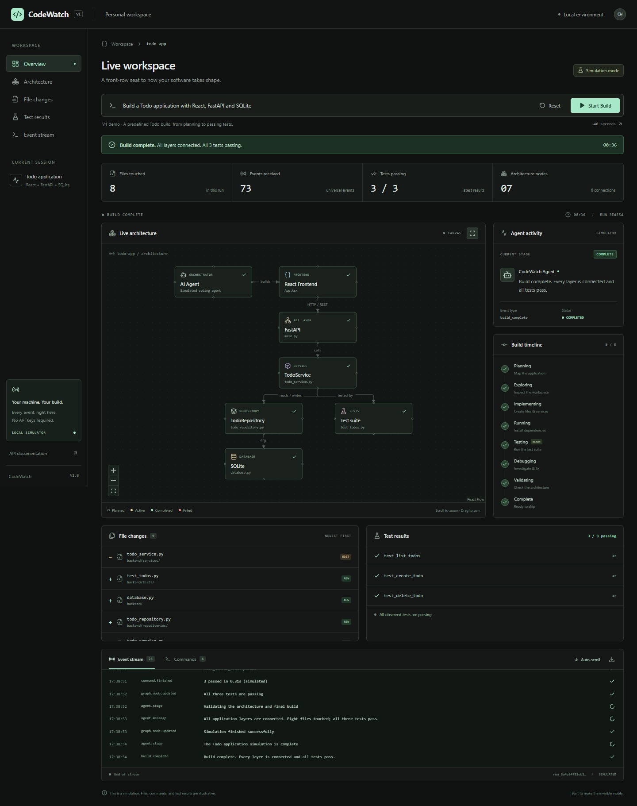

# CodeWatch

**Watch a coding agent's work take shape, one event at a time.**

CodeWatch is a local observability dashboard for coding agents. V1 uses a realistic simulator to show how a Todo application evolves: architecture, file changes, commands, failing tests, debugging, and a successful rerun.

The working name is **CodeWatch**. The frontend product name lives in `frontend/src/config.ts` for a straightforward future rename.



> Screenshots are generated by the browser acceptance test. Run `npm run test:e2e` in `frontend/` to refresh the desktop, debugging, initial, and mobile captures in `docs/`.

## Why it exists

Coding agents produce a stream of work that's hard to follow in a terminal alone. CodeWatch makes their current stage, architecture changes, file activity, and test results visible together. You can see which layer is being worked on and how a failure leads to a fix.

## How V1 works

1. Enter a prompt and press **Start Build**.
2. The dashboard opens `/ws/build` and sends a start message.
3. The simulator creates a unique run ID and emits one validated event approximately every 500 ms.
4. React updates every panel from that event stream.
5. A Todo test fails, the agent fixes the service, all three tests pass on the second attempt, and the run completes after 73 events in approximately 36 seconds.
6. **Reset** closes the connection and clears the entire run without reloading. **Start Build** can also start a fresh run directly after completion or an error.

**V1 is explicitly simulated.** The prompt is editable and display-only: every run follows the same Todo scenario. The demo does not write application files, run terminal commands, invoke an LLM, or create a SQLite database. The `workspace/` directory is reserved for future real execution. The dashboard's 8 files and 3 tests describe the simulated project; they are separate from CodeWatch's own implementation and automated tests.

## Architecture

```text
                 User
                  |
                  | Start / Reset
                  v
           React Dashboard
                  ^
                  | Validated events -> reducer -> UI
                  | WebSocket /ws/build
                  |
               FastAPI
                  ^
                  | Universal Events (Pydantic)
                  |
           Agent Simulator
                  |
           Predefined workflow
```

The simulator is an async event iterator. It knows nothing about FastAPI, WebSockets, React, graph coordinates, or components. FastAPI owns connection handling, and the frontend reducer owns the dashboard state. Layout is a frontend concern.

## Technology stack

| Layer | Tools |
| --- | --- |
| Dashboard | React 19, TypeScript, Vite, plain CSS |
| Graph | React Flow (`@xyflow/react`) |
| Icons | Lucide |
| Event boundary | Pydantic on Python, Zod and inferred TypeScript types in React |
| Backend | Python 3.12+, FastAPI, Uvicorn, WebSockets |
| Verification | pytest, Ruff, Vitest, Playwright |

No API keys, accounts, external services, Docker, or database server are needed. Internet access is needed once to install dependencies; the running app uses local assets and local services.

## Installation and startup

Prerequisites: **Python 3.12+** and **Node.js 22.12+** (tested with Python 3.12 and Node 22). Run the two services in separate terminals.

### 1. Backend — Windows PowerShell

From the project root:

```powershell
cd backend
python -m venv .venv
.\.venv\Scripts\python.exe -m pip install -r requirements.txt
.\.venv\Scripts\python.exe -m uvicorn main:app --reload --host 127.0.0.1 --port 8000
```

Using the virtual environment's Python directly avoids PowerShell activation restrictions. If activation is already enabled, `.venv\Scripts\Activate.ps1` followed by `uvicorn main:app --reload` also works.

### Backend — macOS / Linux

```bash
cd backend
python3 -m venv .venv
source .venv/bin/activate
python -m pip install -r requirements.txt
uvicorn main:app --reload --host 127.0.0.1 --port 8000
```

Backend: [http://localhost:8000](http://localhost:8000) · Health: [http://localhost:8000/health](http://localhost:8000/health) · API documentation: [http://localhost:8000/docs](http://localhost:8000/docs).

### 2. Frontend

In a second terminal, from the project root:

```powershell
cd frontend
npm.cmd install
npm.cmd run dev
```

On macOS/Linux, use `npm` instead of `npm.cmd`. The `.cmd` form also avoids the Windows PowerShell script execution policy error.

Open **[http://localhost:5173](http://localhost:5173)** and press **Start Build**.

### Configuration

- Vite proxies `/ws`, `/health`, and `/events/schema` to `127.0.0.1:8000`. No environment file is needed for the default setup.
- To connect directly to a different backend, copy `frontend/.env.example` to `frontend/.env.local`, set `VITE_WS_URL=ws://127.0.0.1:8000/ws/build`, and restart Vite.
- `CODEWATCH_ALLOWED_ORIGINS` on the backend accepts comma-separated browser origins. Defaults: `http://localhost:5173,http://127.0.0.1:5173`. If you change the frontend port, add that origin. Both HTTP CORS and WebSocket origin checks use this list.
- The default simulator delay is `DEFAULT_EVENT_INTERVAL` in `backend/agent/simulator.py`. Automated backend tests inject a shorter interval; the normal application runs at 500 ms.
- Bind to loopback for this local V1. Authentication and multi-user hosting are outside its scope.

### Production build and preview

```powershell
cd frontend
npm.cmd run build
```

Output is in `frontend/dist/`. To preview locally while the backend is running, configure a direct socket URL before building (the dev proxy is a development convenience):

```powershell
$env:VITE_WS_URL = 'ws://127.0.0.1:8000/ws/build'
npm.cmd run build
npm.cmd run preview -- --port 5173
```

Stop the Vite dev server before previewing on the same port. On macOS/Linux, use `VITE_WS_URL=ws://127.0.0.1:8000/ws/build npm run build`.

## V1 capabilities

- Dark, responsive developer dashboard with a persistent workspace navigation.
- Live React Flow graph: 7 nodes, 6 directed connections, node inspection, zoom, pan, and fit-to-view.
- Planned, active, completed, and failed graph states. Nodes are colored by architectural role.
- All 8 stages: planning, exploring, implementing, running, testing, debugging, validating, complete. The second test visit is marked **RERUN**.
- Current action, event type, status, and the relevant file, test, or command.
- 8 unique simulated files, 9 file changes, with the latest change first.
- Simulated install and pytest commands, with separately tracked attempts, output, and exit codes.
- 3 first-class tests with individual status, failure detail, and attempt numbers.
- A chronological event feed, optional automatic scrolling, and NDJSON log download.
- Unique run IDs, elapsed time, file/event/test/node counters, start, reset, and rerun.
- Connection errors, malformed event detection, timeout recovery, and retry.
- Independent simultaneous runs. Disconnects cancel the corresponding simulator.

## Event architecture

Every producer uses the same versioned envelope:

```json
{
  "schemaVersion": 1,
  "runId": "run_c930a4e2...",
  "eventId": "evt_2d1e5c1a...",
  "sequence": 21,
  "timestamp": "2026-09-15T12:30:00Z",
  "type": "file_created",
  "status": "completed",
  "data": {
    "path": "backend/services/todo_service.py",
    "nodeId": "service",
    "message": "Created backend/services/todo_service.py"
  }
}
```

| Event type | Required data beyond `message` |
| --- | --- |
| `agent_stage` | `stage` |
| `agent_message` | No additional fields |
| `file_created`, `file_modified` | `path`, `nodeId` |
| `command_started`, `command_finished` | `commandId`, `command`; optional `output`, `exitCode` |
| `test_started`, `test_passed`, `test_failed` | `name`, `attempt`; `nodeId` defaults to `tests`; optional `details` |
| `graph_node_added` | `id`, `label`, `kind`, `state`; optional `path` |
| `graph_node_updated` | `nodeId`, `state` |
| `graph_edge_added` | `id`, `source`, `target`, `label` |
| `build_complete` | `filesTouched`, `testsPassed`, `testsTotal` |

`graph_node_updated` is a small extension to the requested event vocabulary. It makes activation, failure, and recovery explicit instead of guessing node state from action text.

- Event `status`: `pending`, `running`, `completed`, `failed`.
- Node `state`: `planned`, `active`, `completed`, `failed`.
- Node `kind`: `agent`, `frontend`, `api`, `service`, `repository`, `database`, `test`.
- A run starts with the dashboard's planned `agent` node. Producers can upsert that node with `graph_node_added`, then explicitly update it.
- IDs are stable references. Sequences increase within a run. The consumer ignores duplicate IDs, old sequences, events from a different run, and deliveries after reset or completion.
- Event timestamps use UTC. The UI displays local time.
- `graph_node_added` upserts by ID. A node update targets an existing node; add nodes before emitting their edges. The UI hides edges until both endpoints exist.
- Tests are keyed by name, with the latest attempt displayed; previous failures remain in the event log. Commands are keyed by invocation ID so reruns do not overwrite earlier output.
- The transport is ordered, in-memory, and one-way after start. V1 does not persist or resume disconnected runs; retry creates a fresh run.

Python models are in `backend/models/events.py`; matching runtime schemas and inferred discriminated TypeScript types are in `frontend/src/types/events.ts`. [GET /events/schema](http://localhost:8000/events/schema) exposes JSON Schema for adapter authors. Both runtimes validate the event boundary.

### WebSocket protocol

Connect to `ws://localhost:8000/ws/build`, then send within 10 seconds:

```json
{"action":"start","prompt":"Build a Todo application with React, FastAPI and SQLite"}
```

Receive one event per text frame. `build_complete` is the final event, followed by a normal close (`1000`). Invalid start messages and disallowed origins close with `1008`; unexpected server failures close with `1011`. Closing the client socket cancels a run. There is no separate start REST endpoint or background job store.

## Verification

From the project root, on Windows:

```powershell
.\backend\.venv\Scripts\python.exe -m pip install -r backend/requirements-dev.txt
.\backend\.venv\Scripts\python.exe -m pytest -q
.\backend\.venv\Scripts\python.exe -m ruff check backend
```

From `frontend/`:

```powershell
npm.cmd test
npm.cmd run build
npm.cmd run test:e2e
```

Playwright uses installed **Google Chrome**. If unavailable, run `npx playwright install chromium` and remove `channel: 'chrome'` from `playwright.config.ts`. The browser suite starts both local services automatically or reuses them when already running; it runs two full simulations, so allow about two minutes. On macOS/Linux the configuration uses `backend/.venv/bin/python` automatically.

Tests cover backend health, schema, origins, pacing, run isolation, graph integrity, failure recovery, reducer correctness, real WebSocket delivery, reset/cancellation, rerun, command history, download, malformed events, and mobile overflow. Browser screenshots are written to `docs/`.

## Project structure

```text
CodeWatch/
|-- backend/
|   |-- main.py                  # FastAPI transport and cancellation
|   |-- agent/
|   |   |-- events.py            # Validated event factory
|   |   |-- simulator.py         # Timed async event source
|   |   `-- workflow.py          # Todo scenario, no execution
|   |-- models/events.py         # Pydantic event contract
|   |-- tests/test_build.py      # Backend integration tests
|   |-- requirements.txt
|   `-- requirements-dev.txt
|-- frontend/
|   |-- src/
|   |   |-- components/          # Graph, activity, timeline, files, tests, log
|   |   |-- hooks/useAgentEvents.ts
|   |   |-- state/build.ts       # Pure event reducer
|   |   |-- types/events.ts      # Runtime schema and TypeScript types
|   |   |-- config.ts            # Product name and default prompt
|   |   |-- App.tsx
|   |   |-- styles.css           # Local stylesheet entry point
|   |   `-- styles/              # Shell, graph, panels, responsive rules
|   |-- e2e/build.spec.ts
|   |-- playwright.config.ts
|   `-- vite.config.ts
|-- docs/                        # Real browser screenshots
|-- workspace/                   # Reserved; no V1 file writes
|-- pyproject.toml
`-- README.md
```

## Future roadmap — intentionally outside V1

```text
       Codex / Claude Code / Cursor
                    |
                    v
            CodeWatch Adapter
                    |
                    v
             Universal Events
                    |
                    v
            CodeWatch Dashboard
```

1. **Real agents:** replace `simulate_build()` with an adapter yielding the same validated envelopes. Each adapter translates the agent's stage, tools, files, and tests; the dashboard stays independent of vendor protocols.
2. **Real execution:** add a workspace-scoped filesystem watcher and command runner behind the producer. Emit actual file and process results. Introduce explicit execution permissions and sandboxing before allowing real writes or commands.
3. **Derived architecture:** use Tree-sitter AST parsing and import analysis to discover nodes and dependencies. Replace the simple role-based canvas layout with an automatic graph layout as projects grow.
4. **Git and review:** emit commit, diff, and GitHub PR analysis events through a versioned extension of the schema.
5. **Observability and tools:** correlate OpenTelemetry traces with run IDs and expose the event stream through an MCP server.
6. **History and isolation:** add optional persistence and resumable streams; consider Neo4j for historical architecture queries and Docker for execution isolation when real workloads justify them.

These integrations, real LLM APIs, authentication, cloud hosting, persistent run history, and real Todo project generation are not implemented in V1.

## Troubleshooting

- **PowerShell refuses `npm` or virtualenv activation:** use `npm.cmd` and the explicit virtualenv Python path shown above.
- **Cannot connect / port already in use:** verify `/health`, stop only the process you started on the conflicting port, and restart both services. Vite uses a strict port so a silent fallback cannot break origin configuration.
- **WebSocket rejected after changing ports:** update `CODEWATCH_ALLOWED_ORIGINS` to include the exact frontend origin, then restart the backend.
- **Preview opens but cannot connect:** build with `VITE_WS_URL` set as described above and keep the backend running.
- **Invalid event error after editing the schema:** update Python and TypeScript contracts together. Check `/events/schema` and rerun the tests.

## Implementation references

The graph uses [React Flow custom nodes](https://reactflow.dev/learn/customization/custom-nodes). The transport follows [FastAPI's WebSocket API](https://fastapi.tiangolo.com/advanced/websockets/); frontend development uses [Vite](https://vite.dev/guide/).
