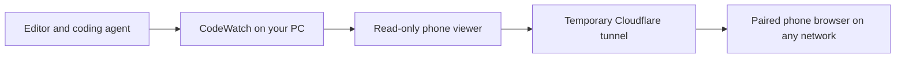

# Follow CodeWatch on your phone

Open the full Windows app, choose a project, then click **Enable phone view** in
the **Phone view** panel. Scan its QR code with your phone's camera and open the
link in your browser. You can also use **Copy phone link**.

The phone can use mobile data, another Wi-Fi network, or be far away from the
computer. Both devices need internet access. Keep the computer awake and
CodeWatch running; **Close to tray** can keep it running in the background.

## What your phone shows

The phone shows the connected work flow, latest agent report, reported working
file, observed saves and result statuses. Select a step to inspect its reported
files, saves, test and command statuses, and current known file connections.
**Follow current** scrolls to the newest step. Reloading the phone page keeps
the pairing while the sharing session is active.

File watching works automatically. Work steps and completion require the same
cooperating MCP agent used by the desktop app. Report-order arrows and observed
saves keep their existing source labels.

The phone has viewing access. It cannot change a project, run commands or change
desktop settings. Source-file contents, terminal output, command arguments, test
details and the absolute project directory are omitted from the phone snapshot.
Report text and relative file names are shared, so choose what your agent reports.

## End the connection

**Stop sharing** revokes every paired browser and stops the internet connection.
Quitting CodeWatch, changing the watched project, or reaching the eight-hour limit
also ends the sharing session. Enable it again to get a new QR code and link.
Sharing starts off on every app launch.

Anyone with the QR code or phone link can pair with this session until it ends.
Up to eight browsers can pair. The link's private pairing code is removed from
the phone's address bar after opening; the browser uses a private cookie to stay
connected. Copying the address bar afterwards does not copy the pairing code.

If the phone loses its connection, it retries automatically. Keep the computer
online. If sharing has ended, scan a new QR code from the desktop.

## Internet connection

CodeWatch bundles a verified Cloudflare connector, so you need no extra installer,
account, router configuration or terminal command. It starts an outbound tunnel
only when you enable phone view, and sends progress through Cloudflare to the
paired browser. The tunnel reaches a separate read-only viewer; the desktop API
and MCP service remain local.

This release uses **temporary Quick Tunnels**. Their addresses change when
sharing restarts, and Cloudflare provides no uptime guarantee. This is a convenient
preview of remote viewing rather than a permanent hosted dashboard. Stable
production hosting is not configured by this release.
[Cloudflare Quick Tunnel limitations](https://developers.cloudflare.com/tunnel/get-started/quick-tunnels/).

## Verification

Backend and native checks cover pairing limits, private cookies, exact tunnel
origin, sanitized snapshots, startup cancellation, expiry, project isolation,
reconnection and revocation. Browser checks cover phone layout, live updates,
selectable steps, private address cleanup, reload and QR controls.

The source version passed an actual internet check through public HTTPS,
including protected pairing, a live agent report, exclusion of desktop routes
and shutdown. Portable executable verification is recorded in
[Windows packaging](windows-packaging.md).
