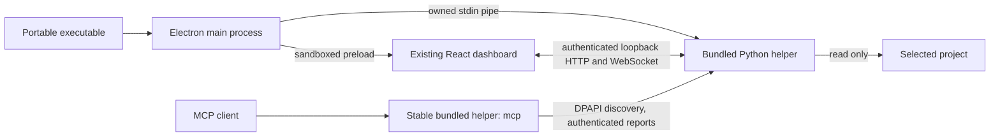

# Windows executable checklist

This milestone packages the existing CodeWatch dashboard as a Windows desktop app.
The larger companion redesign (activity entities, durable replay, native vendor
hooks and guided client configuration) remains separate work.

- [x] Inspect the checkout and preserve existing source; no AGENTS.md found.
- [x] Baseline: 67 backend tests, 13 frontend tests, backend lint.
- [x] Bundle React and Python in a headless helper executable.
- [x] Add a secure Electron window, native folder picker and owned service lifecycle.
- [x] Keep MCP stdio available without an installed Python runtime.
- [x] Build one portable Windows executable; no installer required.
- [x] Verify the final portable launcher, actual file watching, MCP and clean shutdown.
- [x] Document artifact, build commands and remaining limitations.

## Run the app

Download the executable from the [v0.2.1 GitHub release](https://github.com/jarvis0626/CodeWatch/releases/tag/v0.2.1),
or build `dist/windows/CodeWatch-0.2.1-x64-portable.exe` locally. Copy it to a Windows x64
machine and double-click it. Click **Choose folder** to start watching. Use
**Connect your AI** for MCP configuration and reporting instructions.

No installation or administrator rights are required. End users do not need
Python, Node, git or Docker. Internet access is required for the developer build,
not ordinary local file observation. The executable unpacks Electron to a temporary
directory and copies its headless helper into `%APPDATA%/CodeWatch/bin`.
This is one file to distribute, with runtime files created automatically at launch.

The native window is resizable. **Always on top** and **Close to tray** are
optional; both default off. Minimize/restore uses normal Windows behavior.
When close-to-tray is enabled, closing the window continues observation. Use
the tray's **Show CodeWatch**, **Hide window**, or **Quit CodeWatch** actions.
Quit closes only this app's service; it does not stop an IDE or agent.

## Developer build

Requirements: Windows x64, Python 3.12 x64, Node 22.12 or newer, and online package
access. Runtime dependencies/build tools are pinned in
`desktop/requirements-build.lock`; Electron and electron-builder are locked in
`desktop/package-lock.json`. The existing frontend lockfile is reused.

From the repository root:

```powershell
powershell.exe -NoProfile -ExecutionPolicy Bypass -File scripts/build-windows.ps1
```

The script creates the Python environment if needed, installs the locked build
dependencies, builds React, freezes the Python helper, and packages the portable
executable. Once dependencies are installed, `-SkipDependencyInstall` repeats
the build without installing them again. Developer desktop launch after building
the helper:

```powershell
npm.cmd --prefix desktop start
```

An optional `-Installer` switch selects the NSIS setup target. An installer is
unnecessary for running this app, and the optional setup target has not been
locally tested. No build command publishes anything. The GitHub Actions workflow
uploads an executable as a workflow artifact; it creates no public release.

## Verification

The following commands actually ran on Windows 11 x64, build 26200, with
Python 3.12.3, Electron 44.5.1, electron-builder 26.15.3, PyInstaller 6.22.3,
FastAPI 0.141.1 and MCP SDK 1.30.0:

```powershell
backend/.venv/Scripts/python.exe -m pytest -q
backend/.venv/Scripts/python.exe -m ruff check backend scripts/verify-packaged-mcp.py
npm.cmd --prefix frontend test
npm.cmd --prefix frontend run build
npm.cmd --prefix frontend run test:e2e
powershell.exe -NoProfile -ExecutionPolicy Bypass -File scripts/build-windows.ps1 -SkipDependencyInstall
backend/.venv/Scripts/python.exe scripts/verify-packaged-mcp.py --report .local/packaged-mcp-verification.json
```

Results: **111 backend tests, 13 frontend unit tests, 6 browser tests**, lint and
production build passed. New backend checks cover authentication, Host/Origin
validation, HTTP/WebSocket boundaries, streamed body limits, protected discovery,
restart rediscovery, actual readiness, parent-pipe loss and safe cleanup.

The real frozen helper passed an official MCP SDK stdio handshake, discovery of
all seven tools, accepted watch/progress/status/completion reporting, and clean
EOF shutdown with no protocol pollution or shutdown traceback. Its PATH contained
only Windows System32. This proves the packaged bridge, not a vendor application.

The unpacked desktop executable passed the dashboard/native preload, authenticated
HTTP/WebSocket file updates, actual saved-file observation, event-log export,
always-on-top, rejected invalid IPC preferences, close-to-tray/show,
minimize/restore, and owned service cleanup checks. Final portable verification:

```powershell
powershell.exe -NoProfile -ExecutionPolicy Bypass -File scripts/smoke-windows.ps1
```

This uses a disposable project/profile and sets PATH to Windows System32 only.
It retains a JSON report and window screenshot under `.local/packaged-smoke-*`.
The script checks that discovery is removed and no per-profile helper remains
after quit. Timing in the report is one measured sample; it is not a performance
guarantee. `eventToRenderMs` measures the event timestamp to observed updated DOM
with 100 ms polling; `savedFileToRenderMs` also includes scanner polling.

The original v0.2.0 portable executable passed on **2026-10-05**. Its sample measured
**18 ms from event timestamp to updated DOM**, and **654 ms from saved file to
updated DOM**. The full report is
`.local/packaged-smoke-18be9021e9634a3a998b34aa8711e07b/result.json`;
clean quit and absence of the owned helper were also checked by the launcher script.

Artifact: `dist/windows/CodeWatch-0.2.0-x64-portable.exe`, **129,580,290 bytes**.
Authenticode status: **NotSigned**. SHA-256 of this local build:

```text
3A7B50BC54215233A562B2E57BD3C19E07852022C06F690FCDDFE0D8D015FE6B
```

## Project map update: v0.2.1

Version 0.2.1 replaces the default live canvas with folder cards and direct import
lists. The bounded connection diagram is optional; **Hide map** preserves your
selection and viewport. See the [project map guide](project-map.md).

The production build, **19 frontend unit tests** and **7 browser tests** passed
across the demo and live suites. The actual portable executable passed on
**2026-10-05**, including readable folder labels, directed import lists, hide/show,
actual file changes, export, preferences, tray behavior and clean quit. Its PATH
contained only Windows System32. A saved-file sample reached the DOM in **119 ms**
(**24 ms** from event timestamp); these are individual samples.

The isolated desktop report is
`.local/packaged-smoke-76d6d60254a244eeaf414561fa535edb/result.json`. The new frozen
helper also passed the seven-tool MCP handshake, reporting and clean EOF check;
its report is `.local/packaged-mcp-v0.2.1-verification.json`.

Artifact: `dist/windows/CodeWatch-0.2.1-x64-portable.exe`, **129,584,948 bytes**.
Authenticode status: **NotSigned**. SHA-256:

```text
C3A7563955F6A1B1F20C5D220B98A2061567C320C559DC3E3A8825A21DEEF4D9
```

Quit the previous app instance before opening this file. The app has no automatic
updater. Source and executable are distributed through the private repository's
[v0.2.1 release](https://github.com/jarvis0626/CodeWatch/releases/tag/v0.2.1).

## Ownership and security



Electron uses a single-instance lock, a sandboxed renderer with context isolation,
no Node integration, restrictive CSP and three validated preload actions. Native
folder selection and window preferences are limited to the owned main frame.
External navigation, new windows, webviews and downloads other than the explicit
NDJSON export are blocked. Credentials are not exposed in renderer globals, URLs
or protocol stdout. The renderer uses an HttpOnly session cookie.

The backend binds an already-reserved loopback socket on an available port. Main
health-checks it before opening the dashboard. Each launch gets a new credential;
discovery encrypts it with Windows DPAPI. MCP reads discovery for every request,
so an existing MCP process can find the service after a restart. Stale report run
IDs are still rejected. A closed owner pipe shuts the service down after an app
crash; cleanup checks ownership before removing discovery. Logs are bounded and
credentials redacted. Preferences and logs live under `%APPDATA%/CodeWatch`.

## Scope and limitations

| Capability | This build |
| --- | --- |
| Existing live dashboard, file/import watcher, deterministic demo | Reused and tested |
| Windows x64 desktop and portable distribution | Implemented |
| Native folder picker, tray, always-on-top, remembered bounds | Implemented; picker UI and monitor-removal recovery have not been manually exercised |
| Existing cooperative MCP reporting | Packaged protocol tested with the official SDK |
| Actual Codex/Claude/other vendor app connection | Not tested in this packaging milestone; configure using the existing guide |
| Automatic vendor configuration, native hooks, VSIX, managed Codex sessions | Not implemented here |
| New activity graph, durable SQLite replay, compact companion mode | Separate redesign work; existing responsive dashboard remains |
| macOS/Linux or Windows ARM64 packaging | Not built or tested |
| Installer, signing, automatic updates | No installer required; unsigned build, no updater |
| GitHub distribution | Source and portable executable uploaded in the v0.2.0 release at the user's request; repository access is required |

The source CLI remains usable. Its default browser server retains its existing
local API behavior; desktop authentication is enabled for the app-owned service.
Watching does not execute a project's code. History remains in memory, and MCP
setup still requires the supported client's configuration and cooperation.

Packaging references consulted:

- [Electron security](https://www.electronjs.org/docs/latest/tutorial/security)
- [Electron distribution](https://www.electronjs.org/docs/latest/tutorial/distribution-overview)
- [electron-builder Windows targets](https://www.electron.build/docs/win/)
- [Portable target](https://www.electron.build/docs/api/electron-builder.interface.portableoptions/)
- [PyInstaller spec files](https://pyinstaller.org/en/stable/spec-files.html)
- [PyInstaller runtime paths](https://pyinstaller.org/en/stable/runtime-information.html)
