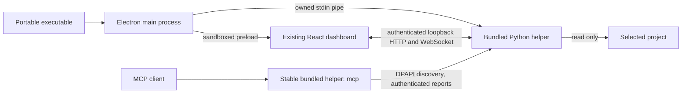

# Windows executable checklist

CodeWatch packages its work flow and project dashboard as a Windows desktop app.
Pinning opens a compact companion with connected steps and clickable evidence.
Durable replay and native vendor hooks remain separate work.

- [x] Inspect the checkout and preserve existing source; no AGENTS.md found.
- [x] Baseline: 67 backend tests, 13 frontend tests, backend lint.
- [x] Bundle React and Python in a headless helper executable.
- [x] Add a secure Electron window, native folder picker and owned service lifecycle.
- [x] Keep MCP stdio available without an installed Python runtime.
- [x] Build one portable Windows executable; no installer required.
- [x] Verify the final portable launcher, actual file watching, MCP and clean shutdown.
- [x] Document artifact, build commands and remaining limitations.

## Run the app

Download the executable from the [v0.5.0 GitHub release](https://github.com/jarvis0626/CodeWatch/releases/tag/v0.5.0),
or build `dist/windows/CodeWatch-0.5.0-x64-portable.exe` locally. Copy it to a Windows x64
machine and double-click it. Click **Choose folder** to start watching. Use
**Connect your AI** for MCP configuration and reporting instructions.

No installation or administrator rights are required. End users do not need
Python, Node, git or Docker. Internet access is required for the developer build,
not ordinary local file observation. The executable unpacks Electron to a temporary
directory and copies its headless helper into `%APPDATA%/CodeWatch/bin`.
This is one file to distribute, with runtime files created automatically at launch.

Every launch opens the full app, even after a compact pinned session. Completing
or skipping the short tutorial saves that choice in the stable Windows profile,
so it stays dismissed after restarting. **Phone view** is optional and starts off;
it bundles its own connector and needs internet on both the PC and phone.
[Phone setup and limitations](phone-view.md).

Fresh completion reports trigger an in-app notification and a Windows toast,
including while the window is hidden. Windows registration adds a per-user Start
Menu shortcut with the app icon, and keeps notification activation pointed at
the original portable executable. Phone push alerts require permission in the
paired browser; on iPhone, use the installed Home Screen view.

The native window is resizable. **Always on top** opens the compact work flow;
**Open full app** restores the full dashboard while keeping it pinned. Full and
compact bounds are remembered separately. **Always on top** and **Close to tray**
are optional; both default off. Minimize/restore uses normal Windows behavior.
When close-to-tray is enabled, closing the window continues observation. Use
the tray's **Show CodeWatch**, **Hide window**, or **Quit CodeWatch** actions.
Quit closes only this app's service; it does not stop an IDE or agent.

## Developer build

Requirements: Windows x64, Python 3.12 x64, Node 22.12 or newer, and online package
access. Runtime dependencies/build tools are pinned in
`desktop/requirements-build.lock`; Electron and electron-builder are locked in
`desktop/package-lock.json`. The existing frontend lockfile is reused.

From the repository root:

```powershell
powershell.exe -NoProfile -ExecutionPolicy Bypass -File scripts/build-windows.ps1
```

The script creates the Python environment if needed, installs the locked build
dependencies, verifies the pinned Cloudflare connector, builds React, freezes the
Python helper, and packages the portable executable. The connector's release and
SHA-256 are pinned in `desktop/cloudflared.json`; its license ships with the app.
Once dependencies are installed, `-SkipDependencyInstall` repeats
the build without installing them again. Developer desktop launch after building
the helper:

```powershell
npm.cmd --prefix desktop start
```

An optional `-Installer` switch selects the NSIS setup target. An installer is
unnecessary for running this app, and the optional setup target has not been
locally tested. No build command publishes anything. The GitHub Actions workflow
uploads an executable as a workflow artifact; it creates no public release.

## Verification

### Original desktop package: v0.2.0

The following commands actually ran on Windows 11 x64, build 26200, with
Python 3.12.3, Electron 44.5.1, electron-builder 26.15.3, PyInstaller 6.22.3,
FastAPI 0.141.1 and MCP SDK 1.30.0:

```powershell
backend/.venv/Scripts/python.exe -m pytest -q
backend/.venv/Scripts/python.exe -m ruff check backend scripts/verify-packaged-mcp.py
npm.cmd --prefix frontend test
npm.cmd --prefix frontend run build
npm.cmd --prefix frontend run test:e2e
powershell.exe -NoProfile -ExecutionPolicy Bypass -File scripts/build-windows.ps1 -SkipDependencyInstall
backend/.venv/Scripts/python.exe scripts/verify-packaged-mcp.py --report .local/packaged-mcp-verification.json
```

Results: **111 backend tests, 13 frontend unit tests, 6 browser tests**, lint and
production build passed. New backend checks cover authentication, Host/Origin
validation, HTTP/WebSocket boundaries, streamed body limits, protected discovery,
restart rediscovery, actual readiness, parent-pipe loss and safe cleanup.

The real frozen helper passed an official MCP SDK stdio handshake, discovery of
all seven tools, accepted watch/progress/status/completion reporting, and clean
EOF shutdown with no protocol pollution or shutdown traceback. Its PATH contained
only Windows System32. This proves the packaged bridge, not a vendor application.

The unpacked desktop executable passed the dashboard/native preload, authenticated
HTTP/WebSocket file updates, actual saved-file observation, event-log export,
always-on-top, rejected invalid IPC preferences, close-to-tray/show,
minimize/restore, and owned service cleanup checks. Final portable verification:

```powershell
powershell.exe -NoProfile -ExecutionPolicy Bypass -File scripts/smoke-windows.ps1
```

This uses a disposable project/profile and sets PATH to Windows System32 only.
It retains a JSON report and window screenshot under `.local/packaged-smoke-*`.
The script checks that discovery is removed and no per-profile helper remains
after quit. Timing in the report is one measured sample; it is not a performance
guarantee. `eventToRenderMs` measures the event timestamp to observed updated DOM
with 100 ms polling; `savedFileToRenderMs` also includes scanner polling.

The original v0.2.0 portable executable passed on **2026-10-05**. Its sample measured
**18 ms from event timestamp to updated DOM**, and **654 ms from saved file to
updated DOM**. The full report is
`.local/packaged-smoke-18be9021e9634a3a998b34aa8711e07b/result.json`;
clean quit and absence of the owned helper were also checked by the launcher script.

Artifact: `dist/windows/CodeWatch-0.2.0-x64-portable.exe`, **129,580,290 bytes**.
Authenticode status: **NotSigned**. SHA-256 of this local build:

```text
3A7B50BC54215233A562B2E57BD3C19E07852022C06F690FCDDFE0D8D015FE6B
```

## Project map update: v0.2.1

Version 0.2.1 replaces the default live canvas with folder cards and direct import
lists. The bounded connection diagram is optional; **Hide map** preserves your
selection and viewport. See the [project map guide](project-map.md).

The production build, **19 frontend unit tests** and **7 browser tests** passed
across the demo and live suites. The actual portable executable passed on
**2026-10-05**, including readable folder labels, directed import lists, hide/show,
actual file changes, export, preferences, tray behavior and clean quit. Its PATH
contained only Windows System32. A saved-file sample reached the DOM in **119 ms**
(**24 ms** from event timestamp); these are individual samples.

The isolated desktop report is
`.local/packaged-smoke-76d6d60254a244eeaf414561fa535edb/result.json`. The new frozen
helper also passed the seven-tool MCP handshake, reporting and clean EOF check;
its report is `.local/packaged-mcp-v0.2.1-verification.json`.

Artifact: `dist/windows/CodeWatch-0.2.1-x64-portable.exe`, **129,584,948 bytes**.
Authenticode status: **NotSigned**. SHA-256:

```text
C3A7563955F6A1B1F20C5D220B98A2061567C320C559DC3E3A8825A21DEEF4D9
```

Quit the previous app instance before opening this file. The app has no automatic
updater. Source and executable are distributed through the private repository's
[v0.2.1 release](https://github.com/jarvis0626/CodeWatch/releases/tag/v0.2.1).

## Work flow companion: v0.3.0

Version 0.3.0 makes the connected work flow the main live view. Pinning switches
the actual native window to a 540 by 720 companion. Clicking a step opens its
report, files, saves, tests, commands and current file connections. Opening the
full app restores its previous size and selected step while retaining the pin.
See the [work flow guide](work-flow.md).

The production build, **114 backend tests, 33 frontend unit tests, 6 native-window
tests and 8 browser tests** passed. Regression checks include activity history
surviving scan traffic and failed reports retaining their status after rollover.

The actual portable executable passed on **2026-10-05** with only Windows System32
on PATH. Checks covered three completed reported steps and two connecting arrows,
compact-only rendering, actual native bounds, clickable step details, full-window
restoration preserving selection, actual file saves, imports, export, tray behavior
and clean quit without an owned helper remaining. A saved-file sample reached the
DOM in **122 ms**, or **58 ms** from event timestamp; these are individual samples.

The isolated report is
`.local/packaged-smoke-3d1145def96c422e8116cb4b91a129cb/result.json`, with screenshots
beside it. The frozen helper passed all seven MCP tools, accepted reports, DPAPI
discovery and clean EOF shutdown; its report is
`.local/packaged-mcp-v0.3.0-verification.json`.

Artifact: `dist/windows/CodeWatch-0.3.0-x64-portable.exe`, **129,593,176 bytes**.
Authenticode status: **NotSigned**. SHA-256:

```text
4146DC479E373498A86E6E32358ED012B14143859508C7DC95D39F8DF3A6F08E
```

The [v0.3.0 release](https://github.com/jarvis0626/CodeWatch/releases/tag/v0.3.0)
distributes the source and portable executable. Quit the previous app before
opening this file; there is no automatic updater.

## Full app, tutorial and phone view: v0.4.0

Every new launch opens the full app, including after a pinned companion session.
Completing or skipping the four-step tutorial persists in the Windows profile.
Optional phone sharing creates a private QR link to a separate read-only viewer
through the bundled Cloudflare connector. See the [phone view guide](phone-view.md).

The production build, lint, **132 backend tests, 33 frontend unit tests, 24 native
tests and 14 browser tests** passed. These include tutorial persistence and save
failure recovery, phone layout and pairing, sanitized snapshots, session expiry,
project isolation, tunnel cancellation and revocation.

The actual portable executable passed on **2026-10-05** with only Windows System32
on PATH:

```powershell
powershell.exe -NoProfile -ExecutionPolicy Bypass -File scripts/smoke-windows.ps1 -Phone
```

The optional `-Phone` check needs internet. It uses the packaged connector and a
separate browser over public HTTPS to verify private pairing, live connected
steps, clickable files, cookie persistence after reload, exclusion of desktop
routes and revocation when sharing stops. It also checks full startup after saved
compact preferences, tutorial completion after reload, actual file saves, the
pinned companion, export, tray behavior and clean owned-process shutdown.

The isolated report is
`.local/packaged-smoke-a408d0e1620f44bab774cc3aaac37f5b/result.json`. One saved-file
sample reached the DOM in **230 ms**, or **85 ms** from event timestamp; these are
individual samples. The frozen helper passed all seven MCP tools, accepted
reports, DPAPI discovery and clean EOF shutdown; its report is
`.local/packaged-mcp-v0.4.0-verification.json`.

Artifact: `dist/windows/CodeWatch-0.4.0-x64-portable.exe`, **143,128,858 bytes**.
Authenticode status: **NotSigned**. SHA-256:

```text
7BEF5B9BF3551E4DA9BE84EDCB25DD485578B64FF8EAF899616F38F169A7C0B4
```

The [v0.4.0 release](https://github.com/jarvis0626/CodeWatch/releases/tag/v0.4.0)
distributes the source and portable executable. Quit the previous app before
opening this file; there is no automatic updater.

## Icons and completion notifications: v0.5.0

The portable launcher and inner desktop executable embed the CodeWatch icon at
16, 24, 32, 48, 64, 128 and 256 pixels. The running window, tray and notifications
use the same mark; phone Home Screen icons use 192 and 512 pixels. The build renders
them from `frontend/public/favicon.svg` using Windows drawing APIs, with no image
service or extra runtime dependency.

Fresh agent completion reports show one in-app notice and one native Windows
notification. Native detection runs in the main process while the window is
hidden. Reload/reconnect history and the paired COMPLETE/build events do not
create duplicate alerts; a new reported task rearms them. Selecting a work card
again closes its details.

Phone completion alerts use encrypted, per-sharing-session Web Push. Setup is
opt-in and requires a compatible browser. An iPhone/iPad Home Screen installation
can pair with its current private phone link and request permission there. Closing
the page does not remove an enabled subscription. Stopping, expiry, project changes
or quitting cancels new/pending sends; messages already accepted by the browser
provider cannot be recalled. See [phone completion setup](phone-view.md#completion-notifications).

The source suites passed **176 backend tests, 45 frontend unit tests, 42 native
tests and 20 browser tests**, plus lint and the production frontend build. Push tests decrypt actual
encrypted payloads with a browser private key and verify VAPID signatures. Browser
checks exercise permission, subscription, installed pairing, revocation and
background service-worker notification handling. These checks do not establish
delivery on a physical locked phone; OS permissions and active sharing remain
required.

Verify the finished executable resources with:

```powershell
node scripts/verify-windows-icons.cjs
```

The packaged `-Phone` smoke additionally checks the native toast with a hidden
window, portable notification activation, in-app notice, click-again card toggle,
public HTTPS pairing and bundled Web Push key/service-worker assets. Verification
results and the artifact checksum follow.

The actual portable executable passed on **2026-10-05** with only Windows System32
on PATH. Windows emitted exactly one native notification `show` event with the
window hidden (**attempted: 1, shown: 1, failed: 0**), and its activation target was
repaired to the original portable EXE. The in-app notice, card collapse/reopen,
public HTTPS pairing, packaged Web Push application key, worker/manifest assets,
existing watcher/companion/tray features and clean quit all passed. The script
also verified removal of discovery and absence of the owned helper after quit.

Report: `.local/packaged-smoke-e30d281cc35a4064baee9f475b30c6b1/result.json`.
One saved-file sample reached the DOM in **222 ms**, or **71 ms** from event time;
these are individual samples. The frozen helper passed the official SDK handshake,
all seven MCP tools, accepted reports, DPAPI discovery and clean EOF shutdown:
`.local/packaged-mcp-v0.5.0-verification.json`.

Resource verification confirmed all seven canonical icon frames in both the
portable launcher and `win-unpacked/CodeWatch.exe`. Artifact:
`dist/windows/CodeWatch-0.5.0-x64-portable.exe`, **148,391,837 bytes**.
Authenticode status: **NotSigned**. SHA-256:

```text
9A428ADDA2C0DCE7B503B4D11E1C7097889F4061193A75737E6B0895888066E7
```

The [v0.5.0 release](https://github.com/jarvis0626/CodeWatch/releases/tag/v0.5.0)
distributes the source and portable executable. Quit the previous app instance
before opening it; there is no automatic updater.

## Ownership and security



Electron uses a single-instance lock, a sandboxed renderer with context isolation,
no Node integration, restrictive CSP and narrow validated preload actions. Native
folder selection and window preferences are limited to the owned main frame.
External navigation, new windows, webviews and downloads other than the explicit
NDJSON export are blocked. Credentials are not exposed in renderer globals, URLs
or protocol stdout. The renderer uses an HttpOnly session cookie.

The backend binds an already-reserved loopback socket on an available port. Main
health-checks it before opening the dashboard. Each launch gets a new credential;
discovery encrypts it with Windows DPAPI. MCP reads discovery for every request,
so an existing MCP process can find the service after a restart. Stale report run
IDs are still rejected. A closed owner pipe shuts the service down after an app
crash; cleanup checks ownership before removing discovery. Logs are bounded and
credentials redacted. Preferences and logs live under `%APPDATA%/CodeWatch`.

## Scope and limitations

| Capability | This build |
| --- | --- |
| Existing live dashboard, file/import watcher, deterministic demo | Reused and tested |
| Windows x64 desktop and portable distribution | Implemented |
| Native folder picker, tray, always-on-top, remembered bounds | Implemented; picker UI and monitor-removal recovery have not been manually exercised |
| Existing cooperative MCP reporting | Packaged protocol tested with the official SDK |
| Actual Codex/Claude/other vendor app connection | Not tested in this packaging milestone; configure using the existing guide |
| Automatic vendor configuration, native hooks, VSIX, managed Codex sessions | Not implemented here |
| Connected work flow and compact pinned companion | Implemented; see the [work flow guide](work-flow.md) |
| Full startup and one-time tutorial | Implemented and tested in the portable executable |
| EXE, window, tray and phone icons | Canonical mark generated from the existing SVG |
| Completion notifications | In-app and native Windows alerts; phone browser push is opt-in and scoped to active sharing |
| Paired phone view across networks | Implemented and tested over public HTTPS; temporary Quick Tunnel, PC must stay online |
| Permanent hosted dashboard | Not configured; Quick Tunnels have no uptime guarantee |
| Durable SQLite replay | Not implemented; bounded session history remains in memory |
| macOS/Linux or Windows ARM64 packaging | Not built or tested |
| Installer, signing, automatic updates | No installer required; unsigned build, no updater |
| GitHub distribution | Source and portable executable are distributed through GitHub Releases; repository access is required |

The source CLI remains usable. Its default browser server retains its existing
local API behavior; desktop authentication is enabled for the app-owned service.
Watching does not execute a project's code. History remains in memory, and MCP
setup still requires the supported client's configuration and cooperation.

Packaging references consulted:

- [Electron security](https://www.electronjs.org/docs/latest/tutorial/security)
- [Electron distribution](https://www.electronjs.org/docs/latest/tutorial/distribution-overview)
- [electron-builder Windows targets](https://www.electron.build/docs/win/)
- [Portable target](https://www.electron.build/docs/api/electron-builder.interface.portableoptions/)
- [PyInstaller spec files](https://pyinstaller.org/en/stable/spec-files.html)
- [PyInstaller runtime paths](https://pyinstaller.org/en/stable/runtime-information.html)
